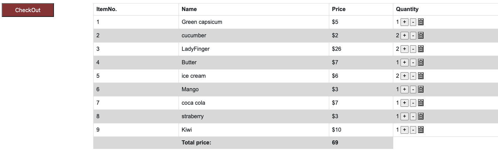

# Project2-GroceryList

## Project setup
Installation - clone this repo and open in VS code then 

open terminal
.....>cd client
.....>npm install
......>npm start 

Goto terminal
......>cd server
.....>npm install
......>npm start 

## Project output
Open chrome browser go to http://localhost:1234/ to see output

The Grocery market page will be display on screen: 

.To perform any CRUD functioning that means create, update and delete data, goto "click here" link which is displayed on right side next to nav bar. ("For admins only Click here to update Grocery Items")

. When admin click on link provided it opens a login page,
    please use below credentials for admin login:

           "user name": vathsala
           "password": vathsaladmin

. After succesfull login,this allows admin to add, update and delete grocery items.

.When "Add" button is clicked it asks user to enter required item deatails to add it

similarly there is a form for Update and Delete as well.

(added category names are displayed on home page in the fixed side bar)

. When user clicks on the category name on side bar it shows list of all items added in that category in a table format next to it.

. There is an option "Add to cart" next to each item, if user clicks on it, that item will be added to the cart on top.

.When user clicks on "Cart" it shows all items added to the cart
. The cart displays items in a table format with +, - and delete buttons next to each item in the list which makes easier for user to add more items, remove listed item, and delete items respectively.

. there is a "CheckOut" to continue with the order.

. there is a create an account option for new users to signup 
